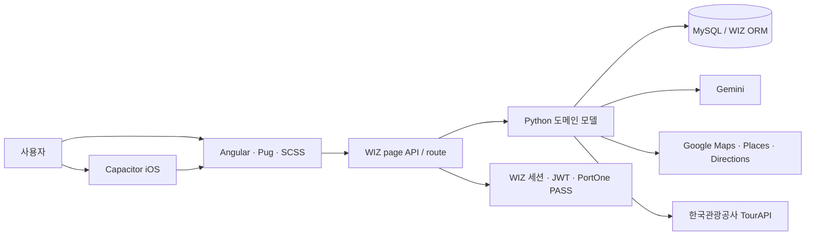

# GACHI

> 여행지를 고르는 대화부터 일정 생성, 코스 편집, 동행 모집, 지도 길안내와 여행 기록까지 하나의 흐름으로 연결하는 AI 여행 웹 서비스입니다.

[](https://github.com/xericen/GACHI/actions/workflows/quality.yml)
[](SECURITY.md)

- 운영 서비스: [https://travel.wizide.com/](https://travel.wizide.com/)
- GitHub: [xericen/GACHI](https://github.com/xericen/GACHI)
- 주요 기술: WIZ Framework, Angular, TypeScript, Python, MySQL

## GACHI는 어떤 서비스인가요?

여행을 준비할 때는 여행지 추천, 장소 검색, 일정 조정, 이동 경로 확인, 동행 모집과 기록 관리가 각각 다른 서비스에 흩어져 있습니다. GACHI는 이 작업을 하나의 여행 코스 중심으로 묶습니다.

1. AI와 대화하며 출발지, 날짜, 동행, 이동수단과 취향을 정리합니다.
2. 여행지가 정해지지 않았다면 조건에 맞는 후보 3곳을 추천받습니다.
3. 실제 장소 데이터를 이용해 날짜별 일정을 만들거나 직접 코스를 편집합니다.
4. 확정한 코스를 내 코스에 저장하고 동행 모집 또는 지도 실행에 사용합니다.
5. 여행 중 웹 지도에서 경로를 확인하고, 여행 후 커뮤니티와 마이페이지에 기록을 남깁니다.

## 현재 제공하는 기능

### 1. AI 여행 플래너

- 오늘, 내일, 이번 주말, `1박 2일` 같은 자연어 날짜 해석
- 연인, 친구, 가족, 혼자 등 동행 유형과 도보·대중교통·차량 이동수단 정규화
- 감성, 힐링, 사진, 먹방 같은 표현을 실제 여행 취향으로 변환
- 출발지·기간·동행·교통 조건을 수집한 뒤 여행지 후보 3곳 제안
- 대화가 길어져도 여행 상태를 누적하고 이미 답한 조건을 반복 질문하지 않음
- 내부 장소와 Google Places 결과를 이용한 결정론적 일정 생성
- 가까운 장소를 같은 권역으로 묶고 왕복·지그재그·과도한 우회를 줄이는 동선 정책
- 날짜별 장소 추가·삭제·교체, 예산·취향·일수 변경을 기존 초안에 부분 반영
- 생성 실패 시 자연스러운 안내로 복구하고 내부 도구명·검증 오류는 사용자에게 숨김
- 같은 메시지의 중복 전송·저장·응답을 `client_message_id`로 방지
- 코스 확정 시 한 번만 저장하고 현재 대화는 보관한 뒤 새 채팅으로 전환

AI 여행 상태는 다음 흐름으로 관리됩니다.

```text
조건 수집 → 생성 준비 → 일정 생성 → 초안 확인 → 부분 수정 → 코스 확정
          ↘ 여행지 추천 → 후보 선택 ↗
```

### 2. 직접 코스 제작과 저장

- 여러 여행 지역을 한 코스에 추가·삭제
- 내부 장소, Google Places 검색 결과와 지도 POI를 일정에 추가
- 일차별 장소 순서, 방문 시각, 체류시간과 이동 메모 편집
- 장소 카테고리 자동 판정 및 직접 변경
- 장소 카드에서 내부 상세, Google 지도 상세, 메뉴·가격 정보 확인
- 구간별 이동수단·거리·예상시간 요약
- 브라우저 임시 초안과 전체 편집 상태 복원
- 코스 공개 범위, 태그, 설명과 동행 모집 정보 설정
- 내 코스와 저장한 코스를 구분해 보관하고 삭제

### 3. 지도와 여행 실행

- Google Maps 기반 일반 장소 검색, 주변 장소와 저장 코스 표시
- 현재 위치 또는 입력한 주소를 출발지로 설정
- 전체 코스를 한눈에 맞춘 뒤 원하는 장소까지 경로 조회
- 대중교통·도보·차량별 실제 경로와 최대 3개 대안 비교
- 버스 노선, 승하차 정류장, 환승, 도보 구간과 차량 회전 단계 표시
- 별도 Google 지도 창을 열지 않는 웹 내부 단계별 길안내
- 안내 중 현재 위치 추적과 일정 거리 이동 시 경로 재계산
- 코스 실행, 장소별 체크인, 여행 상태 보관
- 여행 기간에만 활성화되는 위치 공유형 같이 지도

웹 길안내는 경로 확인과 위치 기반 재계산을 제공하지만 음성 안내, 차선 정보, 백그라운드 실행 같은 전용 내비게이션 기능을 대체하지는 않습니다.

### 4. 동행과 커뮤니티

- 내 코스 또는 저장한 다른 사용자의 코스를 불러와 동행 모집
- 원작자와 원본 코스 ID를 포함한 코스 출처 표시
- 모집 인원과 선택형 추가 조건을 작성해 동행 게시물 등록
- 여행 이력서와 성향 정보를 이용한 동행 신청
- 여행지 주변 즉석 만남 신호, 수락·신고·자동 만료
- 동행 준비방, 즉석 만남 채팅과 1:1 메시지
- 후기·질문·사진·태그·투표가 포함된 커뮤니티 게시물
- 좋아요, 댓글, 저장, 공유와 작성자 삭제·신고 메뉴

### 5. 홈, 마이페이지와 운영 기능

- 지역·테마별 장소, 인기 코스, 커뮤니티와 동행 콘텐츠 탐색
- 현재 위치 또는 선택 지역의 현재 날씨와 월간/단기 날씨 캘린더
- 새로고침 가능한 날씨 정보와 읽음 상태를 관리하는 알림 화면
- 저장 장소·코스, 최근 본 항목, 작성 게시물과 여행 기록 관리
- PortOne V2 기반 PASS 본인 인증과 여행 이력서 간편 입력
- 사용자·장소·추천 코스·공지·약관·AI 모델 설정을 관리하는 관리자 화면

### 6. iOS 모바일 앱

- Capacitor 8 기반 iOS 앱 셸과 WIZ 웹 번들 동기화
- Safe Area, 키보드, 뒤로가기, 외부 링크와 네트워크 오류 대응
- 네이티브 위치·카메라·푸시 알림과 코스·채팅 딥링크 연결
- 저장 코스 일부 오프라인 열람
- Universal Link용 AASA 응답과 APNs 작업 큐·재시도 워커
- GitHub Actions의 서명 없는 Simulator 빌드 및 수동 서명 archive 흐름

모바일 앱은 웹 서비스의 기능을 재사용합니다. 실제 배포에는 Apple Developer App ID, Team ID, 프로비저닝, APNs 키와 macOS/Xcode 환경이 별도로 필요합니다.

## 서비스 구조



AI 응답 문장과 일정 생성은 분리되어 있습니다. Gemini는 사용자 의도와 변경된 조건을 구조화하고, 서버 상태 머신이 생성 여부를 결정합니다. 실제 일정은 서버가 내부 장소 ID, 좌표, 카테고리, 이동시간과 운영 제약을 검증해 조립합니다. 신규 하네스에 문제가 생기면 런타임 설정으로 레거시 실행기로 전환할 수 있습니다.

## 기술 스택

| 영역 | 기술 및 역할 |
|---|---|
| 프론트엔드 | Angular, TypeScript, Pug, SCSS |
| 애플리케이션 | WIZ Framework page/route/portal 구조 |
| 백엔드 | Python API, 상태 머신, 일정 조립 엔진 |
| 데이터 | MySQL, WIZ ORM, Node.js 데이터 운영 스크립트 |
| AI | Gemini, 실행 하네스, 검증·재시도·레거시 폴백 |
| 지도·장소 | Google Maps JavaScript API, Places API, Directions API |
| 관광 데이터 | 한국관광공사 TourAPI |
| 인증 | WIZ 세션/JWT, PortOne V2 PASS 본인 인증 |
| 모바일 | Capacitor 8, Swift iOS 셸, APNs, Universal Link |
| 품질 | Python `unittest`, WIZ EsBuild, GitHub Actions, 민감정보 검사 |

## 프로젝트 구조

```text
GACHI/
├── .github/                    # CI, Dependabot, PR 템플릿, CODEOWNERS
├── .githooks/                  # 커밋 전 민감정보 검사
├── config-sample/              # 공개 가능한 Python 설정 예시
├── docs/                       # AI 설계, 운영 가이드와 기술 검토 문서
├── mobile/                     # Capacitor 설정, iOS 프로젝트와 모바일 검증 도구
├── scripts/                    # DB 이관, 장소 수집·보강, 만료 작업
├── services/                   # TourAPI·Google Places 클라이언트
├── src/
│   ├── angular/                # Angular/WIZ 빌드 설정
│   ├── app/                    # 화면, 레이아웃, 화면 전용 API
│   │   └── page.access/        # GACHI의 주요 통합 앱 화면
│   ├── assets/                 # 브랜드, 폰트와 정적 자산
│   ├── controller/             # 공통 서버 컨트롤러
│   ├── model/                  # DB 모델, AI, 일정·장소 도메인 로직
│   │   ├── agents/             # 여행 NLU, 상태 머신, 일정 엔진
│   │   └── ai_harness/         # 공급자·도구·저장·검증·관측 계층
│   ├── portal/                 # 인증 및 공통 WIZ 포털 모듈
│   └── route/                  # 코스·장소·지도·동행·관리자 API
├── tests/                      # AI 하네스, 상태 머신, UI 계약 테스트
├── .env.example                # 환경변수 예시
├── CONTRIBUTING.md             # 브랜치·커밋·PR 규칙
├── SECURITY.md                 # 취약점 신고 및 보안 정책
└── package.json                # 운영 스크립트와 Node.js 의존성
```

## 개발 환경 준비

### 요구 사항

- Git
- Node.js와 npm
- Python 3
- WIZ Framework가 설치되고 프로젝트 실행 권한이 있는 환경
- 로컬 또는 개발용 데이터베이스
- 외부 연동 기능을 사용할 경우 해당 API 자격증명
- iOS 빌드·실기기 검증 시 macOS, Xcode와 Apple Developer 계정

### 1. 저장소 받기

```bash
git clone git@github.com:xericen/GACHI.git
cd GACHI
npm ci
```

루트의 npm 의존성은 데이터 운영 스크립트용입니다. 화면과 Python 앱의 빌드·실행은 WIZ 프로젝트 환경에서 수행합니다.

### 2. 로컬 설정 만들기

```bash
cp .env.example .env
mkdir -p config
cp config-sample/database.py config/database.py
cp config-sample/ai.py config/ai.py
cp config-sample/auth.py config/auth.py
```

`config/`와 `.env`는 Git에서 제외됩니다. 샘플 파일에는 실제 키, 비밀번호, 운영 주소나 사용자 데이터를 넣지 마세요.

### 3. 주요 설정

| 설정 | 용도 | 위치/노출 |
|---|---|---|
| `TOUR_API_KEY` | 관광지·음식점·숙박·쇼핑 데이터 수집 | 서버 전용 `.env` |
| `GOOGLE_PLACES_API_KEY` | 장소 검색·상세·평점 수집 | 서버 전용 `.env` |
| `GOOGLE_MAPS_BROWSER_API_KEY` | 브라우저 Google 지도 표시 | 배포 환경, referrer 제한 필수 |
| `GOOGLE_DIRECTIONS_API_KEY` | 서버 경로 계산 | 서버 전용, 선택 사항 |
| `GOOGLE_AI_API_KEY` 또는 `GEMINI_API_KEY` | Gemini AI 호출 | 서버 전용 환경변수 |
| `GEMINI_MODEL` | 사용할 Gemini 모델 | 선택 사항 |
| `PORTONE_STORE_ID` | PortOne 상점 ID | 브라우저 전달 가능 |
| `PORTONE_IDENTITY_CHANNEL_KEY` | PASS 인증 채널 | 브라우저 전달 가능 |
| `PORTONE_API_SECRET` | 인증 결과 서버 검증 | 서버 전용 |
| `MYSQL_HOST` 등 `MYSQL_*` | Node.js 운영 스크립트 DB 연결 | 서버 전용 `.env` |
| `APPLE_TEAM_ID`, `APPLE_APP_ID_PREFIX` | iOS 서명·AASA 앱 식별 | 서버/CI 전용 |
| `APNS_KEY_ID`, `APNS_PRIVATE_KEY_PATH` | APNs 발송 워커 인증 | 서버 전용, 키 파일 커밋 금지 |

Gemini는 환경변수 대신 `config/ai.py`의 `gemini` 설정으로도 구성할 수 있습니다. 브라우저 지도 키는 서버 API가 주입하며, 이전 배포 방식의 `window.TOUR_ON_GOOGLE_MAPS_API_KEY`도 호환됩니다. 공개 브라우저 키라도 HTTP referrer와 허용 API를 반드시 제한하세요.

### 4. 빌드와 테스트

```bash
# WIZ 프로젝트 빌드
wiz project build --project=main

# 전체 Python 자동 테스트
python -m unittest discover -s tests -p 'test_*.py'

# Python 구문 검사
python -m compileall -q src tests

# 전체 추적 파일 민감정보 검사
npm run secrets:check

# 루트 Node.js 의존성 취약점 검사
npm audit --audit-level=low

# iOS 셸 정적 검증과 웹 번들 동기화
npm --prefix mobile ci
npm run mobile:verify
npm run mobile:sync
```

일반 변경은 증분 빌드를 사용합니다. WIZ 앱/API 함수의 추가·삭제·이름 변경 후 메타데이터 문제가 남는 경우에만 clean build를 수행하세요.

현재 자동 테스트는 다음 계약을 다룹니다.

- 여행 자연어 해석과 상태 누적
- 여행지 추천, 일정 생성·부분 수정과 동선 품질
- Gemini 오류·검증 실패·레거시 폴백 복구
- 채팅 저장·삭제·소유권·중복 요청 방지
- 모바일 채팅 스크롤, 코스 닫기·복원, 확정 저장 순서

## 데이터 운영 명령

아래 명령은 외부 API를 호출하거나 DB를 변경할 수 있습니다. 실행 전에 대상 환경과 백업, API 일일 한도를 확인하세요.

| 명령 | 역할 |
|---|---|
| `npm run db:migrate-courses` | 코스 관련 스키마·데이터 이관 |
| `npm run tourapi:seed-places` | TourAPI 장소 기본 데이터 수집 |
| `npm run tourapi:hydrate-place-details` | 기존 장소 상세 정보 보강 |
| `npm run google:match-places` | 내부 장소와 Google Place 매칭 |
| `npm run google:fetch-ratings` | Google 평점·리뷰 수 갱신 |
| `npm run signals:expire` | 만료된 즉석 만남 신호 정리 |
| `npm run push:check` | APNs 설정과 워커 연결 사전 확인 |
| `npm run push:worker` | APNs 작업 큐 상시 발송 워커 실행 |

`LIMIT`, `GOOGLE_PLACES_DELAY_MS`, `GOOGLE_RATING_CACHE_DAYS`, `TOUR_API_TIMEOUT_MS` 등으로 배치 범위와 호출 속도를 조절할 수 있습니다.

## 안전한 Git 작업

저장소의 pre-commit 훅은 스테이징된 파일에서 API 키, 토큰, 비밀번호, 개인키와 로컬 설정값을 검사합니다.

```bash
npm run hooks:install
git config --get core.hooksPath
# .githooks

git add <변경 파일>
npm run secrets:check:staged
git commit -m "feat: 변경 내용"
```

권장 협업 흐름은 GitHub Flow입니다.

1. 최신 `main`에서 `feat/*`, `fix/*`, `docs/*`, `chore/*` 브랜치를 만듭니다.
2. Conventional Commits 형식으로 작은 기능 단위 커밋을 작성합니다.
3. Pull Request를 열고 `quality` 검사와 CODEOWNERS 리뷰를 통과합니다.
4. Squash merge로 `main`을 항상 배포 가능한 상태로 유지합니다.

세부 규칙은 [CONTRIBUTING.md](CONTRIBUTING.md), 비공개 취약점 신고 절차는 [SECURITY.md](SECURITY.md)를 참고하세요. `--no-verify`로 보안 검사를 우회하지 마세요.

## 보안 원칙

- 커밋 금지: `.env`, `config/`, DB 덤프, 운영 로그, 업로드 파일, 개인키, 서비스 계정 JSON
- 공개 가능: `.env.example`, `config-sample/`, 비밀값이 제거된 구조와 예제
- 노출이 의심되면 파일 삭제만 하지 말고 해당 키를 즉시 폐기·재발급
- 이미 원격에 올라간 비밀값은 Git 이력에서도 제거
- 사용자 위치, 인증 결과, 채팅 원문과 개인식별정보를 운영 로그에 남기지 않음
- 관리자 최초 생성 기능은 사용 직후 비활성화하고 DB 계정에는 최소 권한만 부여

## 알려진 제약과 운영 과제

- Google Maps의 일부 기존 `Marker` 사용부는 Advanced Marker로 이전이 필요합니다.
- Google `DirectionsService` 사용부는 Routes API로 단계적으로 전환해야 합니다.
- 경로 대안과 대중교통 세부 정보는 Google 및 운송 사업자가 제공하는 범위에 따라 달라집니다.
- 외부 관광 이미지 제공처의 CORS·가용성에 따라 일부 이미지가 표시되지 않을 수 있습니다.
- 위치 공유와 즉석 만남은 HTTPS, 위치 권한과 만료 작업의 정상 실행이 필요합니다.
- 다중 서버에서 채팅 중복 처리를 완전히 직렬화하려면 공유 캐시 또는 분산 잠금이 필요합니다.
- PASS 인증은 PortOne 상점·채널 설정과 허용 도메인이 일치해야 합니다.
- iOS 실기기 푸시와 Universal Link는 Apple 자격증명, 공개 AASA 배포와 TestFlight 검증이 필요합니다.

## 기여 및 라이선스

버그와 기능 제안은 GitHub Issue 양식을 사용하고, 보안 문제는 공개 이슈가 아닌 Security Advisory로 신고해 주세요.

현재 별도의 라이선스 파일은 제공되지 않습니다. 코드의 재사용·재배포 범위는 저장소 소유자에게 확인해야 합니다.
