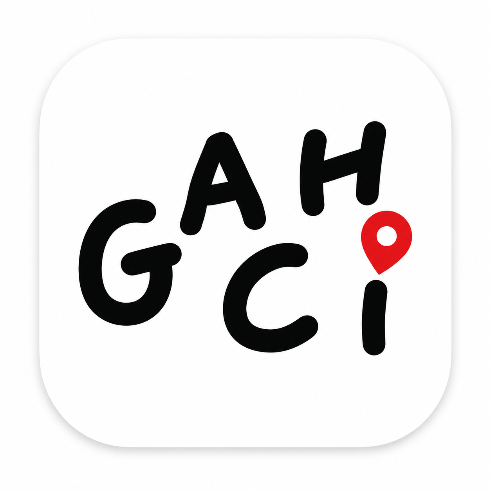
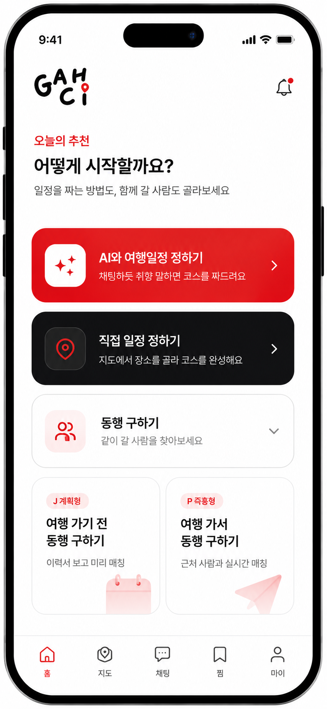
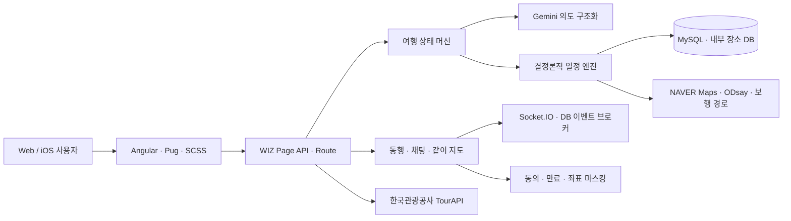
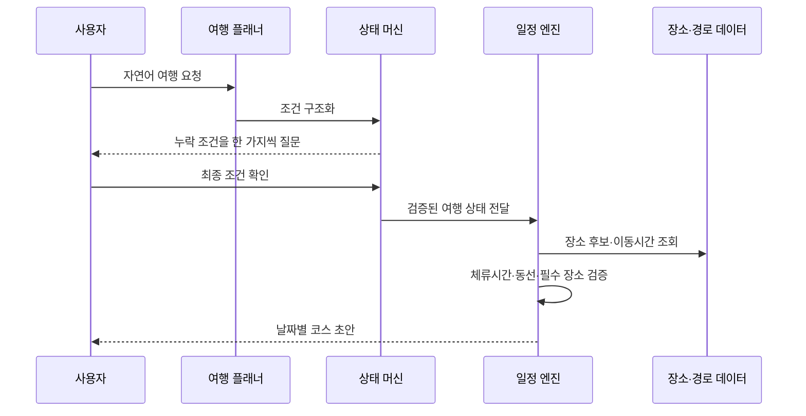

<p align="center">
  
</p>

<h1 align="center">GACHI</h1>

<p align="center">
  <strong>AI가 여행 계획을 만들고, 사람과 장소를 연결하며, 여행 중 길안내까지 이어주는 올인원 여행 플랫폼</strong>
</p>

<p align="center">
  여행지 탐색부터 일정 생성, 코스 편집, 동행 매칭, 실시간 위치 공유와 여행 기록까지<br />
  흩어진 여행 경험을 하나의 코스 중심으로 연결했습니다.
</p>

<p align="center">
  <a href="https://travel.wizide.com/"></a>
  <a href="https://github.com/xericen/GACHI/actions/workflows/quality.yml"></a>
  
  
</p>

<p align="center">
  
</p>

## 프로젝트 한눈에 보기

| 항목 | 내용 |
|---|---|
| 서비스 | AI 여행 계획·코스·동행·지도·기록 통합 플랫폼 |
| 형태 | 반응형 웹 서비스 + Capacitor 기반 iOS 앱 |
| 운영 주소 | [travel.wizide.com](https://travel.wizide.com/) |
| 핵심 사용자 | 여행 계획이 막막한 사용자, 함께 여행할 동행을 찾는 사용자 |
| 핵심 가치 | **계획부터 실행까지 끊기지 않는 여행 경험** |
| 주요 기술 | Angular, TypeScript, Python, WIZ Framework, MySQL, Gemini, NAVER Maps, Socket.IO |

## 왜 만들었나요?

여행자는 보통 여러 서비스를 오가며 여행을 준비합니다.

- 검색 서비스에서 여행지를 찾고
- 메모나 스프레드시트로 일정을 정리하고
- 지도에서 이동 시간을 다시 계산하고
- 커뮤니티에서 동행을 구하고
- 메신저에서 약속과 위치를 공유합니다.

GACHI는 이 단절을 **여행 코스**라는 하나의 데이터로 통합했습니다. AI와 나눈 대화가 실제 일정이 되고, 확정한 일정이 동행 모집과 길안내, 같이 지도와 여행 기록으로 이어집니다.

```text
취향·조건 입력 → AI 일정 생성 → 코스 편집·저장 → 동행 매칭 → 길안내·위치 공유 → 여행 기록
```

## 핵심 사용자 경험

### 1. 대화만으로 만드는 여행 일정

사용자가 여행지를 정하지 못했어도 출발지, 날짜, 동행, 이동수단, 일정 속도와 취향을 차례로 정리해 후보 지역과 코스를 제안합니다.

- `이번 주말`, `1박 2일`, `부모님과 함께` 같은 자연어 조건 해석
- 시작 위치와 숙소 위치를 분리해 첫 이동·숙소 복귀 시간 계산
- 도보 허용 시간, 휴식 빈도, 장소별 체류시간을 일정 밀도에 반영
- 생성 전 조건 확인, 생성 후 장소 줄이기·덜 걷기·식당 교체 지원
- 후보 부족이나 외부 경로 실패 시 조건 완화 선택지로 복구

AI가 장소 이름과 일정을 자유롭게 만들어내지 않도록, 대화 해석과 일정 생성을 분리했습니다. Gemini는 의도를 구조화하고 서버 상태 머신과 결정론적 일정 엔진이 실제 장소 ID, 좌표, 체류시간과 이동 제약을 검증합니다.

### 2. 직접 편집하고 다시 사용하는 코스

- 날짜별 장소 추가·삭제·순서 변경
- 방문 시각, 체류시간, 이동수단과 메모 편집
- 공개 코스와 내 코스, 저장한 코스를 분리 관리
- 코스 원작자와 원본 ID를 보존한 공유·재사용
- 공개 코스를 기반으로 동행 모집글 작성

### 3. 앱 안에서 끝나는 길안내

- NAVER Dynamic Map 기반 지도와 장소 좌표 표시
- NAVER Directions 5 자동차 실경로 및 대안 비교
- ODsay 대중교통 노선과 환승 정보, 제공자 실패 시 안전한 대체 경로
- 무료 보행 경로와 브라우저 음성 안내
- 현재 위치 또는 사용자가 입력한 출발지 기준 순차 길안내
- 경로 품질, 후보 급감, 외부 API 실패율과 생성시간 관측

### 4. 여행 전부터 여행 중까지 이어지는 동행

- 여행 이력서와 조건을 활용한 동행 신청·수락
- 확정 코스 기반 동행 준비방과 1:1 실시간 메시지
- 읽음, 입력 중, 재연결, 전송 실패 재시도 상태
- 여행 중 참가자 전용 같이 지도와 GPS 위치 공유
- 양쪽 동의, 30분·1시간·여행 종료 만료, 집·숙소 보호 구역 좌표 마스킹
- 차단·신고 저장 및 약속 종료 시 위치·채팅 상태 정리

## 포트폴리오 핵심 구현

| 영역 | 해결한 문제 | 구현 내용 |
|---|---|---|
| AI 설계 | 대화형 AI의 조건 누락과 반복 질문 | 슬롯 기반 상태 머신, 명시적 생성 확인, 응답 검증·복구 |
| 일정 엔진 | 거리만 가까운 비현실적 코스 | 이동·체류시간, 시작점·숙소, 식사·필수 장소를 함께 최적화 |
| 경로 품질 | 권역 점프·역방향·외부 API 실패 | 경로 품질 판정, 후보 교체, 다중 제공자 폴백, 운영 지표 |
| 실시간 기능 | 채팅·위치 갱신의 지연과 중복 | Socket.IO 사용자 방, DB 이벤트 브로커, 메시지 ID 중복 제거 |
| 위치 안전 | 정확한 좌표의 과도한 노출 | 상호 동의, 서버 만료, 보호 반경 마스킹, 차단·신고 |
| 빌드 안정화 | WIZ 생성 작업공간의 의존성 누락 | Angular 20 빌드 어댑터와 의존성 자가복구 |
| 품질 관리 | 큰 통합 화면의 회귀 위험 | Python 계약 테스트, Playwright 모바일 E2E, GitHub Actions |
| 보안 | 키·비밀번호의 실수 커밋 | `.env` 분리, pre-commit 비밀정보 검사, 서버 전용 자격증명 |

## 여행의 분위기까지 담는 서비스

<table>
  <tr>
    <td width="33%"></td>
    <td width="33%"></td>
    <td width="33%"></td>
  </tr>
  <tr>
    <td align="center">산책과 휴식</td>
    <td align="center">자연과 전망</td>
    <td align="center">야경과 사진</td>
  </tr>
  <tr>
    <td width="33%"></td>
    <td width="33%"></td>
    <td width="33%"></td>
  </tr>
  <tr>
    <td align="center">카페와 감성</td>
    <td align="center">지역 음식</td>
    <td align="center">함께 만드는 여행</td>
  </tr>
</table>

## 시스템 구조



### AI 일정 생성 흐름



## 기술 스택

| 구분 | 기술 |
|---|---|
| Frontend | Angular 20, TypeScript, Pug, SCSS |
| Backend | Python, WIZ Framework Page/Route API |
| Database | MySQL, WIZ ORM, Node.js 운영 스크립트 |
| AI | Gemini, 상태 머신, 도구 호출 검증, 결정론적 일정 엔진 |
| Map & Route | NAVER Dynamic Map, Directions 5, ODsay, openrouteservice/OSM |
| Realtime | Socket.IO, 사용자별 방, DB 이벤트 브로커 |
| Identity | WIZ Session/JWT, PortOne 통합 본인 인증 |
| Mobile | Capacitor 8, Swift iOS Shell, APNs, Universal Link |
| Quality | Python unittest, Playwright, npm audit, GitHub Actions |

## 숫자로 보는 프로젝트

| 지표 | 확인된 결과 |
|---|---:|
| 내부 장소 데이터 제공자 마이그레이션 | 19,754건 |
| Python 자동 회귀 테스트 | 154건 통과 |
| 대표 여행 경로 품질 실측 | 성공 4개 코스 모두 `simple_route_ok=true` |
| 목 기반 모바일 브라우저 회귀 | 4개 시나리오 통과 |
| npm 보안 감사 | 루트·Angular·모바일 취약점 0건 |
| 원격 빌드 | GitHub Actions Quality·iOS 성공 |

수치는 2026년 8월 저장소 개발 로그와 최신 검증 결과를 기준으로 합니다. 외부 경로 API 응답시간과 성공률은 제공자 상태 및 호출 시점에 따라 달라질 수 있습니다.

## 프로젝트 구조

```text
GACHI/
├── e2e/                       # 모바일 화면·동행·위치·채팅 E2E
├── mobile/                    # Capacitor iOS 프로젝트
├── scripts/                   # DB 마이그레이션·장소 보강·만료 작업
├── src/
│   ├── angular/               # Angular/WIZ 빌드 어댑터
│   ├── app/page.access/       # 주요 UI·API·Socket.IO 컨트롤러
│   ├── assets/                # 브랜드·장소 이미지
│   ├── model/agents/          # 여행 상태 머신과 일정 엔진
│   ├── model/db/              # 장소·동행·채팅·위치 데이터 모델
│   ├── portal/                # WIZ 공통 모듈
│   └── route/                 # 지도·장소·관리 API
├── tests/                     # Python 자동 회귀 테스트
├── playwright.config.ts       # 브라우저 E2E 설정
└── package.json               # 빌드·검증·운영 명령
```

## 로컬 실행과 검증

### 요구 사항

- Node.js 20 이상과 npm
- Python 3
- WIZ Framework 실행 환경
- MySQL 개발 데이터베이스
- iOS 검증 시 macOS와 Xcode

```bash
git clone git@github.com:xericen/GACHI.git
cd GACHI
npm ci

cp .env.example .env
mkdir -p config
cp config-sample/database.py config/database.py
cp config-sample/ai.py config/ai.py
cp config-sample/auth.py config/auth.py
```

실제 API 키와 운영 설정은 `.env`와 `config/`에만 저장하며 Git에 커밋하지 않습니다.

### 주요 검증 명령

```bash
# Python 회귀 테스트
python -m unittest discover -s tests -p 'test_*.py'

# 민감정보와 의존성 취약점 검사
npm run secrets:check
npm audit --audit-level=low

# Playwright E2E
npm run test:e2e

# iOS 셸 검증
npm run mobile:verify
```

### 외부 연동 환경변수

| 변수 | 용도 | 노출 범위 |
|---|---|---|
| `TOUR_API_KEY` | 관광지·음식점·숙박 데이터 | 서버 전용 |
| `NAVER_MAPS_CLIENT_ID` | Dynamic Map·Geocoding | 허용 도메인 제한 |
| `NAVER_MAPS_CLIENT_SECRET` | Directions 5 | 서버 전용 |
| `ODSAY_API_KEY` | 대중교통 경로 | 서버 전용 |
| `OPENROUTESERVICE_API_KEY` | 보행 경로 | 서버 전용 |
| `GEMINI_API_KEY` | AI 의도 구조화 | 서버 전용 |
| `PORTONE_API_SECRET` | 본인 인증 결과 검증 | 서버 전용 |

## 품질과 보안

- 스테이징 파일의 API 키·토큰·비밀번호·개인키를 pre-commit에서 차단합니다.
- `.env`, `config/`, DB, 운영 로그, 업로드와 테스트 결과물은 Git에서 제외합니다.
- 사용자 위치는 참가자와 공개 기간을 서버에서 다시 검증합니다.
- 정확한 좌표는 상호 동의 상태에서만 제공하고 보호 구역에서는 마스킹합니다.
- Quality와 iOS GitHub Actions가 `main` 푸시마다 실행됩니다.

```bash
npm run hooks:install
git add <변경 파일>
npm run secrets:check:staged
git commit -m "feat: 변경 내용"
```

## 현재 제약과 다음 단계

- NAVER Directions 5는 자동차 경로 중심이므로 대중교통·보행은 별도 제공자와 대체 경로를 함께 운영합니다.
- 브라우저가 백그라운드 위치 실행을 제한하면 앱 복귀 시 위치를 재동기화합니다.
- 다중 서버 확장 시 Socket.IO 세션 고정과 공유 어댑터 운영 구성이 필요합니다.
- iOS 실기기 푸시와 App Store 배포에는 Apple 서명 자격증명과 TestFlight 검증이 필요합니다.
- 실제 사용자 환경의 장기 위치 공유, 배터리 소모와 네트워크 전환 테스트를 계속 보강할 예정입니다.

## 링크

- **Live**: [https://travel.wizide.com/](https://travel.wizide.com/)
- **Repository**: [https://github.com/xericen/GACHI](https://github.com/xericen/GACHI)
- **Contribution Guide**: [CONTRIBUTING.md](CONTRIBUTING.md)
- **Security Policy**: [SECURITY.md](SECURITY.md)

---

<p align="center">
  <strong>GACHI — 계획부터 동행, 이동과 기록까지 함께.</strong>
</p>
